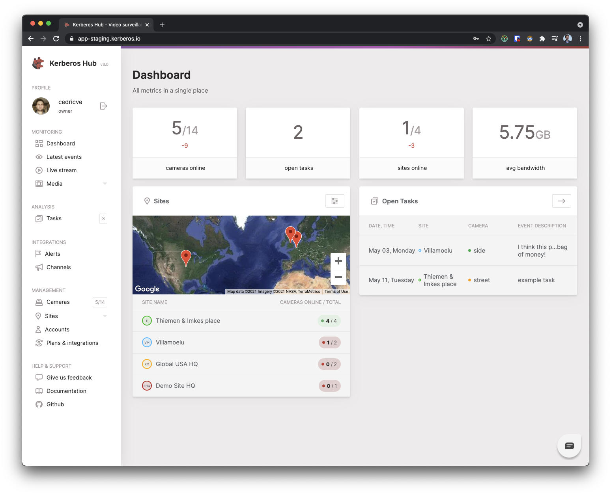
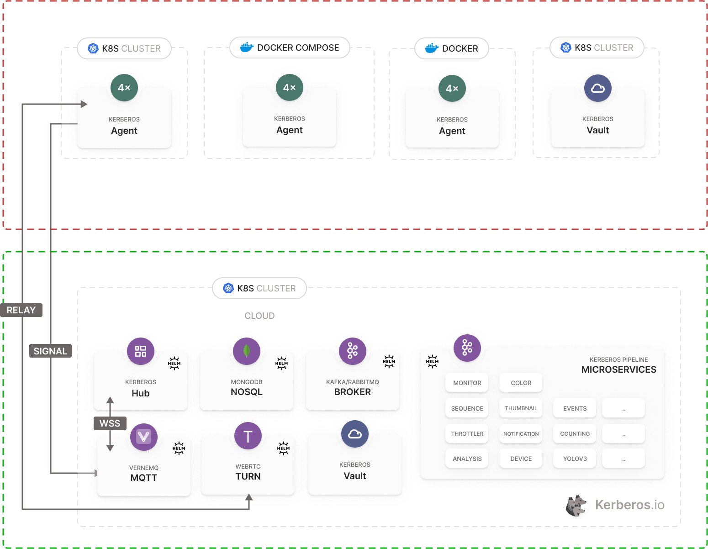
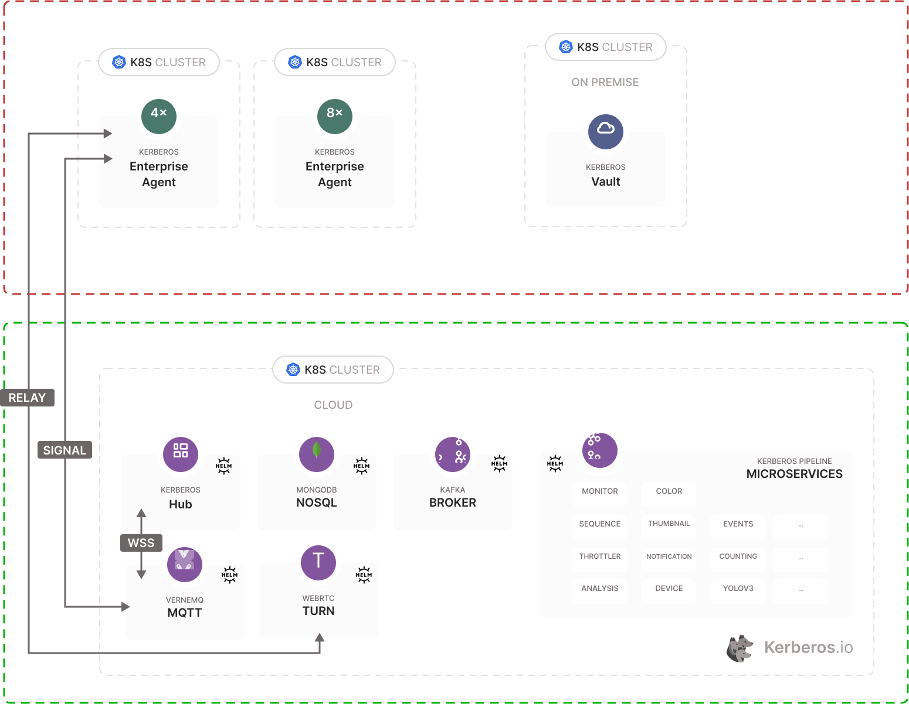

# Kerberos Hub (hub-0.33.0)

Kerberos Hub is the single pane of glass for your Kerberos Agents. It comes with a best of breed open source technology stack, modular and scale first mindset, and allows you to build and maintain an everless growing video surveillance and video analytics landscape.

## License

To use Kerberos Hub a license is required. This license will grant access the Kerberos Hub API, and allow to connect a number of cameras and Kerberos Vaults. Request a license at `support@kerberos.io`.

## Installation

The Kerberos Hub service has several dependencies, as described below. Different components needs to be installed and are leveraged by Kerberos Hub to store data (MongoDB), bi-directional communication (MQTT/Vernemq), etc. Each of these services are installed through the concept of Helm charts. Once all dependencies are installed you will see that Kerberos Hub itself is [also installed through the Kerberos Hub helm chart](https://github.com/kerberos-io/helm-charts/tree/main/charts/hub).

## What's in the repo?

This repo describes how to install Kerberos Hub inside your own Kubernetes cluster (or [K3S cluster](https://k3s.io/)) using a Helm chart.

A couple of dependencies need to be installed first:
- A Kafka message queue,
- a Mongodb database,
- a MQTT message broker ([Vernemq](https://vernemq.com/))
- and a TURN server ([Pion](https://github.com/pion/turn))

Next to that one can use an Nginx ingress controller or Traefik for orchestrating the ingresses. Once all dependencies are installed, the appropriate values [should be updated in the Kerberos Hub `values.yaml`](https://github.com/kerberos-io/helm-charts/blob/main/charts/hub/values.yaml) file.

We do manage certificates through cert-manager and letsencrypt, and rely on HTTP01 and DNS01 resolvers. So you might need to change that for your custom scenarion (e.g. on premise deployment).

# What are we building?

As shown below you will find the architecture of what we are going to install (the green rectangle).

# Let's give it a try.

## Add helm repos

The Kerberos Hub installation makes use a couple of other charts which are shipped within their on Helm repos. Therefore, we will add those repos to our Kubernetes cluster.

    helm repo add bitnami https://charts.bitnami.com/bitnami
    helm repo add jetstack https://charts.jetstack.io
    helm repo add traefik https://helm.traefik.io/traefik
    helm repo add vernemq https://vernemq.github.io/docker-vernemq
    helm repo add kerberos https://charts.kerberos.io
    helm repo update

## Cert manager

We rely on cert-manager and letsencrypt for generating all the certificates we'll need for the Kerberos Hub web interface, Kerberos Hub api and the Vernemq broker (WSS/TLS).

As a best practice we will install all the dependencies in their own namespace. Let's start by creating a separate namespace for cert-manager.

    kubectl create namespace cert-manager

Install the cert-manager helm chart into that namespace.

    helm install cert-manager jetstack/cert-manager --namespace cert-manager --set installCRDs=true

If you already have the CRDs install you could get rid of `--set installCRDs=true`.

Next we will install a cluster issuer that will make the HTTP01 challenges, this is needed for resolving the certificates of both Kerberos Hub web interface and api.
    
    kubectl apply -f cert-manager/cluster-issuer.yaml

## Optional - Rancher

A great way to manage your cluster through a UI is Rancher. This is totally up to you, but we love to use it a Kerberos.io

    helm repo add rancher-latest https://releases.rancher.com/server-charts/latest
    helm repo update
    kubectl create namespace cattle-system
    helm install rancher rancher-latest/rancher \
    --namespace cattle-system \
    --set hostname=rancher.kerberos.xxx \
    --set ingress.tls.source=letsEncrypt \
    --set letsEncrypt.email=xxx@email.com \
    --set 'extraEnv[0].name=CATTLE_TLS_MIN_VERSION' \
    --set 'extraEnv[0].value=1.2'

## Kafka

Kafka is used for the Kerberos Pipeline, this is the place where microservices are executed in parallel and/or sequentially. These microservices will receive events from a Kafka topic and then process the recording, and it's metadata. Results are injected back into Kafka and passed on to the following microservices. Microservices are independently horizontal scalable through replicas, this means that you can distribute your workload across your nodes if a specific microservice requires that.

As a best practice let's create another namespace.

    kubectl create namespace kafka

Before installing the Kafka helm chart, go and have a look in the kafka/values.yaml file. You should update the clientUsers and clientPasswords. Have a look at the zookeeper credentials as well and update accordingly.
    
    helm install kafka bitnami/kafka -f ./kafka/values.yaml -n kafka

## MongoDB

A MongoDB instance is used for data persistence. Data might come from the Kerberos Pipeline or user interaction on the Kerberos Hub frontend.

We will create a namespace for our Mongodb deployment as well.

    kubectl create namespace mongodb

Create a persistent volume, this is where the data will be stored on disk.

    kubectl apply -f ./mongodb/fast.yaml

Before installing the mongodb helm chart, go and have a look in the `mongodb/values.yaml` file. You should update the root password to a custom secure value.

    helm install mongodb bitnami/mongodb --values ./mongodb/values.yaml -n mongodb

## Vernemq

Next to Kafka, we are using MQTT for bidirectional communication in the Kerberos ecosystem. This Vernemq broker, which is horizontal scalable, allows communicating with Kerberos agents at the edge (or wherever they live) and Kerberos Vault to forward recordings from the edge into the cloud.

We'll create a namespace for our message broker Vernemq.

    kubectl create namespace vernemq

Create a certificate, so we can handle TLS/WSS. (this needs a DNS challenge)

    kubectl apply -f vernemq/vernemq-secret.yaml --namespace cert-manager
    kubectl apply -f vernemq/vernemq-issuer.yaml --namespace cert-manager
    kubectl apply -f vernemq/vernemq-certificate.yaml --namespace cert-manager

By default, a username and password is set for the Vernemq broker. You can find these in the `vernemq/values.yaml` file [as shown below](https://github.com/kerberos-io/hub/blob/master/vernemq/values.yaml#L216-L217).

    ...
    - name: DOCKER_VERNEMQ_USER_YOURUSERNAME
    value: "yourpassword"
    ...

Please note that the username is defined in capitals `YOURUSERNAME`, but will result as `yourusername`. So anything written in capitals, will be lowercase. 

Go a head and install the Vernemq chart with the relevant configuration options.

    helm install vernemq vernemq/vernemq -f vernemq/values.yaml  --namespace vernemq

## TURN/STUN

Within Kerberos Hub we allow streaming live from the edge to the cloud without port-forwarding. To make this work we are using a technology called WebRTC that leverages a TURN/STUN server. 

To run a TURN/STUN server please [have a look at following repository](https://github.com/kerberos-io/turn-and-stun), this will deploy a Docker container on a specific host that will act as a proxy for network traversal. The TURN/STUN server will make sure a connection from a Kerberos Agent to a Kerberos Hub viewer is established.

## Install Nginx ingress

Ingresses are needed to expose the Kerberos hub front-end and api to the internet or intranet. We prefer nginx ingress but if you would prefer Traefik, that is perfectly fine as well.

    helm upgrade --install ingress-nginx ingress-nginx \
    --repo https://kubernetes.github.io/ingress-nginx \
    --namespace ingress-nginx --create-namespace

### or (option) Install traefik

     helm install traefik traefik/traefik -f ./traefik/values-ssl.yaml

## Kerberos Hub 

So once you hit this step, you should have installed a previous defined dependencies. Hopefully you didn't have too much pain with the certificates. Go to [the Kerberos Hub helm chart repo](https://github.com/kerberos-io/helm-charts/blob/main/charts/hub) when installing for the first time, there you'll find all the relevant information for configuring and creating.

If you already know what to do, grab the latest `values.yaml` at the [Kerberos Hub Helm chart repo](https://github.com/kerberos-io/helm-charts/blob/main/charts/hub/values.yaml), and reference it from your `helm install` or `helm upgrade` command.

Install the Kerberos Hub chart in a specific namespace and take into the values.yaml file.

    helm install hub kerberos/hub --values values.yaml -n kerberos-hub --create-namespace

Upgrade the Kerberos Hub chart

    helm upgrade hub kerberos/hub --values values.yaml -n kerberos-hub

Uninstall the Kerberos Hub chart

    helm uninstall hub -n kerberos-hub

