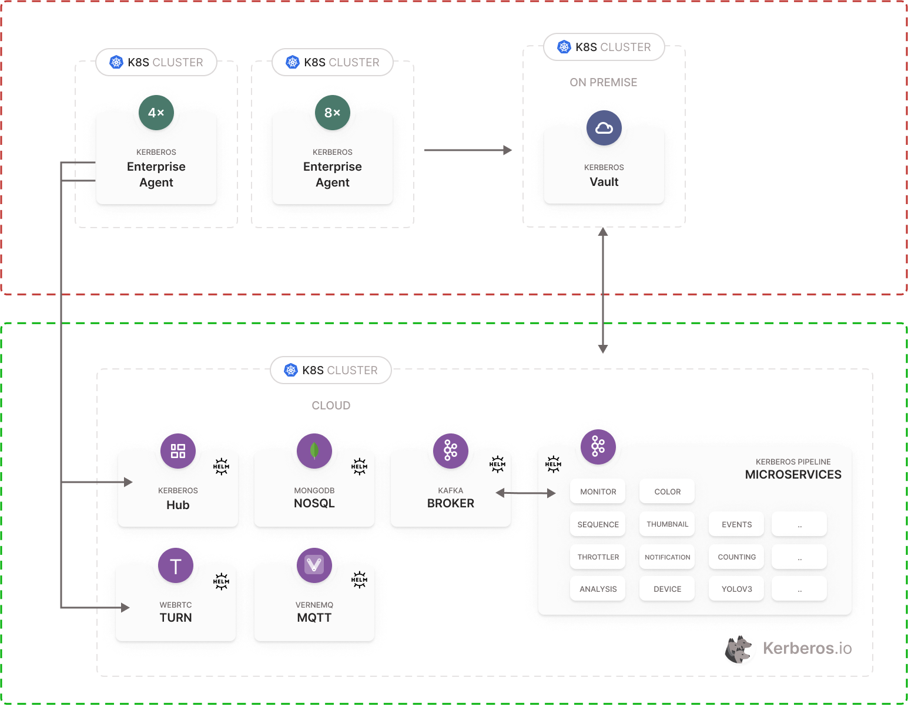

# Kerberos Hub

Kerberos Hub is the single pane of glass for your Kerberos agents. It comes with a best of breed open source technology stack, modular and scale first mindset, and allows you to build and maintain an everless growing video surveillance and video analytics landscape.

## License

To use Kerberos Hub a license is required. This license will grant access the Kerberos Hub API, and allow to connect a number of cameras and Kerberos Vaults.

## What's in the repo?

This repo describes how to install Kerberos Hub inside your own Kubernetes cluster (or [K3S cluster](https://k3s.io/)) using a Helm chart.
A couple of dependencies need to be installed first:
- A Kafka message queue,
- a Mongodb database,
- a MQTT message broker ([Vernemq](https://vernemq.com/)
- and a TURN server ([Pion](https://github.com/pion/turn))

Next to that one can use an Nginx ingress controller or Traefik for orchestrating the ingresses. Once all dependencies are installed, the appropriate values should be updated in the **values.yaml** file.

We do manage certificates through cert-manager and letsencrypt, and rely on HTTP01 and DNS01 resolvers. So you might need to change that for your custom scenarion (e.g. on premise deployment).

# What are we building?

As shown below you will find the architecture of what we are going to install (the green rectangle).

# Let's give it a try.

## Add helm repos

The Kerberos Hub installation makes use a couple of other charts which are shipped within their on Helm repos. Therefore we will add those repos to our Kubernetes cluster.

    helm repo add bitnami https://charts.bitnami.com/bitnami
    helm repo add jetstack https://charts.jetstack.io
    helm repo add traefik https://helm.traefik.io/traefik
    helm repo add vernemq https://vernemq.github.io/docker-vernemq
    helm repo add kerberos https://kerberos-io.github.io/hub
    helm repo update

## Cert manager

We rely on cert-manager and letsencrypt for generating all the certificates we'll need for the Kerberos Hub web interface, Kerberos Hub api and the Vernemq broker (WSS/TLS).

As a best practice we will install all the dependencies in their own namespace. Let's start by creating a separate namespace for cert-manager.

    kubectl create namespace cert-manager

Install the cert-manager helm chart into that namespace.

    helm install cert-manager jetstack/cert-manager --namespace cert-manager --set installCRDs=true

If you already have the CRDs install you could get rid of `--set installCRDs=true`.

Next we will install a cluster issuer that will make the HTTP01 challenges, this is needed for resolving the certificates of both Kerberos Hub web interface and api.
    
    kubectl apply -f cert-manager/cluster-issuer.yaml

## Optional - Install Rancher

A great way to manage your cluster through a UI is Rancher. This is totally up to you, but we love to use it a Kerberos.io

    helm repo add rancher-latest https://releases.rancher.com/server-charts/latest
    helm repo update
    kubectl create namespace cattle-system
    helm install rancher rancher-latest/rancher \
    --namespace cattle-system \
    --set hostname=rancher.kerberos.live \
    --set ingress.tls.source=letsEncrypt \
    --set letsEncrypt.email=cedric@verstraeten.io \
    --set 'extraEnv[0].name=CATTLE_TLS_MIN_VERSION' \
    --set 'extraEnv[0].value=1.2'

## Install Kafka

Kafka is used for the Kerberos Pipeline, this is the place where microservices are executed in parallel and/or sequentially. These micro services will receive events from a Kafka topic and then process the recording and it's metadata. Results are injected back into Kafka and passed on to the following micro services. Micro services are independently horizontal scalable through replicas, this means that you can distribute your workload accross your nodes if a specific micro service requires that.

As a best practice let's create another namespace.

    kubectl create namespace kafka

Before installing the Kafka helm chart, go and have a look in the kafka/values.yaml file. You should update the clientUsers and clientPasswords. Have a look at the zookeeper credentials as well and update accordingly.
    
    helm install kafka bitnami/kafka -f ./kafka/values.yaml -n kafka

## Install MongoDB

A MongoDB instance is used for data persistence. Data might come from the Kerberos Pipeline or user interaction on the Kerberos Hub frontend.

We will create a namespace for our Mongodb deployment as well.

    kubectl create namespace mongodb

Create a persistent volume, this is where the data will be stored on disk.

    kubectl apply -f ./mongodb/fast.yaml

Before installing the mongodb helm chart, go and have a look in the `mongodb/values.yaml` file. You should update the root password to a custom secure value.

    helm install mongodb bitnami/mongodb --values ./mongodb/values.yaml -n mongodb

## Vernemq

Next to Kafka, we are using MQTT for bidirectional communication in the Kerberos ecosystem. This Vernemq broker, which is horizontal scalable, allows to communicate with Kerberos agents at the edge (or wherever they live) and Kerberos Vault to forward recordings from the edge into the cloud.

We'll create a namespace for our message broker Vernemq.

    kubectl create namespace vernemq

Create a certificate so we can handle TLS/WSS. (this needs a DNS challenge)

    kubectl apply -f vernemq/vernemq-secret.yaml --namespace cert-manager
    kubectl apply -f vernemq/vernemq-issuer.yaml --namespace vernemq
    kubectl apply -f vernemq/vernemq-certificate.yaml --namespace vernemq

Installing the repo and the chart.

    helm install vernemq vernemq/vernemq -f vernemq/values.yaml  --namespace vernemq

## Install Nginx ingress

Ingresses are needed to expose the Kerberos hub front-end and api to the internet or intranet. We prefer nginx ingress but if you would prefer Traefik, that is perfectly fine as well.

    kubectl create namespace ingress-nginx
    helm install nginx ingress-nginx/ingress-nginx -n ingress-nginx

### or (option) Install traefik

     helm install traefik traefik/traefik -f ./traefik/values-ssl.yaml

### Kerberos Hub 

So once you hit this step, you should have installed a the previous defined dependencies. Hopefully you didn't had too much pain with the certificates :).
Before starting it's important to have a look at the `values.yaml` file. This includes the different parameters to configure the different deployments.
Reach out to us if you would need any help with this.

As previously mentioned a couple of times, we should also create a kerberos namespace.

    kubectl create namespace kerberos

Install the `registry credentials` to download the Kerberos Hub and Kerberos Pipeline. You'll need to request the `regcred.yaml` from the Kerberos team, to be able to download the Kerberos Hub images.

    kubectl apply -f regcred.yaml -n kerberos

Install the Kerberos Hub chart and take into the values.yaml file.

    helm install kerberoshub kerberos/hub --values values.yaml -n kerberos

Uninstall the Kerberos Hub chart

    helm uninstall kerberoshub -n kerberos

### Post installation

After the installation you'll need to initialise the Mongodb with some objects. Have a look at the `mongodb/` folder, you'll find three files available:

- settings.nosql
- subscriptions.nosql
- users.nosql

Open your favourite Mongodb client (or cli) and connect to your Mongodb database as previously created (or have already installed). Import the previous mentioned `.nosql` files into a new database called `Kerberos`.

Once done you should be able to sign in with following credentials:

- username: youruser
- password: yourpassword

### Subscription settings

Once the collections are loaded in the Mongodb instance, you should see the `user`, `subscriptons` and `settings` collections. Those three collections will allow a user to login into the Kerberos Hub web interface, using the previously mentioned username and password. 

Next to that, in the `subscriptions` collection you will find a subscription for that specific user. The subscription specifies which kind of access the user has in terms of features and upload quota. 

Building further on those `subscriptions`, you will find a `settings` collection that contains the quota for each `subscription`.

### Indexing

Following indexes should be executed on the MongoDB database (Kerberos) to improve future performance.

    db.getCollection('sequences').createIndex({start:1, end:1, user_id:1})
    
    db.getCollection('sequences').createIndex({start:1, user_id:1})
    
    db.getCollection('sequences').createIndex({user_id:1, end: 1})
    
    db.getCollection('sequences').createIndex({user_id:1, "images.key":1})

# Upgrade

After installation you might want to upgrade Kerberos Hub to the latest version, or change some of the settings. With Helm charts all settings are configured through the `values.yaml` file. After you made modifications to the `values.yaml` file, for example the version tag or a new DNS name, you can run the `helm upgrade` command as following.

    helm upgrade kerberoshub kerberos/hub -f values.yaml -n kerberos

The first argument is the helm project name, you could find this out by running `helm ls -n kerberos`. The following element is the helm chart name, and the last one is the `values.yaml` file with the new configuration.

# Building

To build a new release the following steps needs to be executed.

    helm lint 

    helm package hub
    mv hub-*.tgz hub

    helm repo index hub --url https://kerberos-io.github.io/hub
    cd hub
    cat index.yaml
    
