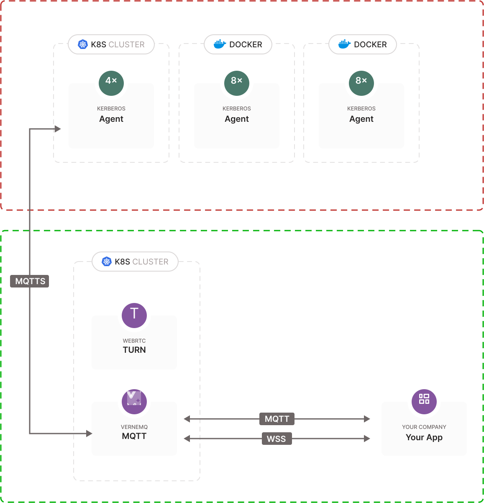

# Example: live streaming SD

Kerberos Hub provides two types of live view: a low resolution live view and a high resolution  (on demand) live view. Depending on the situation you might leverage one over the other, or, both. Below we will explain the differences, and how to open and negotiate a low resolution live view event with the agent. It's important to understand that live view is an on-demand action, which requires a negotiation between the requesting client (Kerberos Hub or your application) and the remote agent. This negotiation will setup a live view sessions between the client and the agent, for a short amount of time. Once the client closes the connection, the agent will stop forwarding the live view.

## Low resolution

Kerberos Hub and Kerberos Agent provides a low resolution live view, which includes a low frames-per-second (FPS) stream of JPEGs. Depending on the key frame interval of the underlaying camera, an agent will retrieve key frames and forward them over MQTT (TCP and WSS) to the client application. Please see below graphic for more details.

